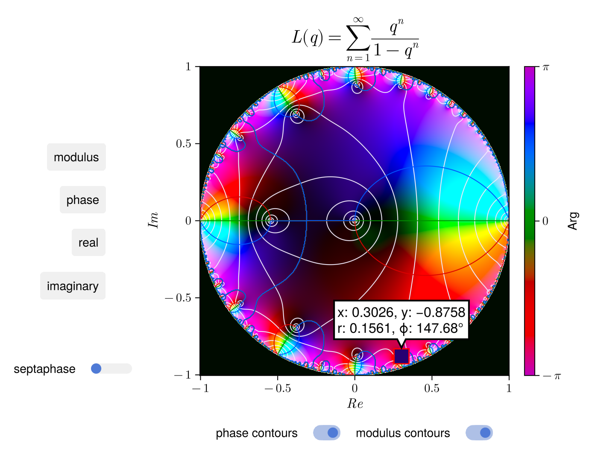

# ComplexColor.jl



`complex_color(s, color = HSL)` converts an array of complex numbers into an image matrix of RGB values using a hue-lightness color mapping for the phase and modulus.

`complex_plot(x, y, s, color = HSL)` plots a complex number array `s` within the `x` and `y` limits using domain coloring in the HSL or perceptual OKLCH color spaces.

***Note***: The phase contour lines are kinda bugged at the moment at around `±π`; these contours are not displayed by default, but can be toggled on the plot.

## Installation

```julia
using Pkg
Pkg.add(url="https://github.com/Sagnac/ComplexColor.jl")
```

Support for the Oklch color space requires the following fork:
```julia
Pkg.add(url="https://github.com/Sagnac/Colors.jl")
```

## Plotting examples

```julia
using ComplexColor
# construct the complex array
x = y = -2:0.01:2
z = complex.(x, y')
s = map(z -> 1/z, z)
# transform the complex array into an image
fig = complex_plot(x, y, s; title = L"s = z^{-1}")
```

```julia
# for a complex function f with intervals
x = y = -2..2
f(z) = inv(z)
complex_plot(x, y, f)
```
